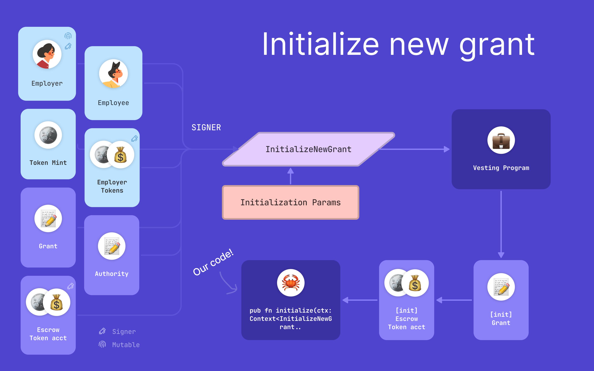
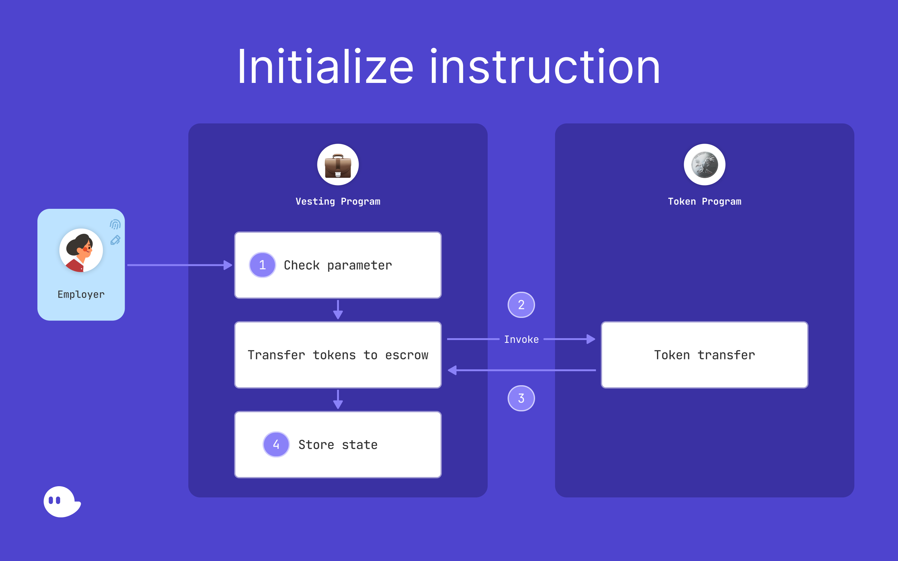
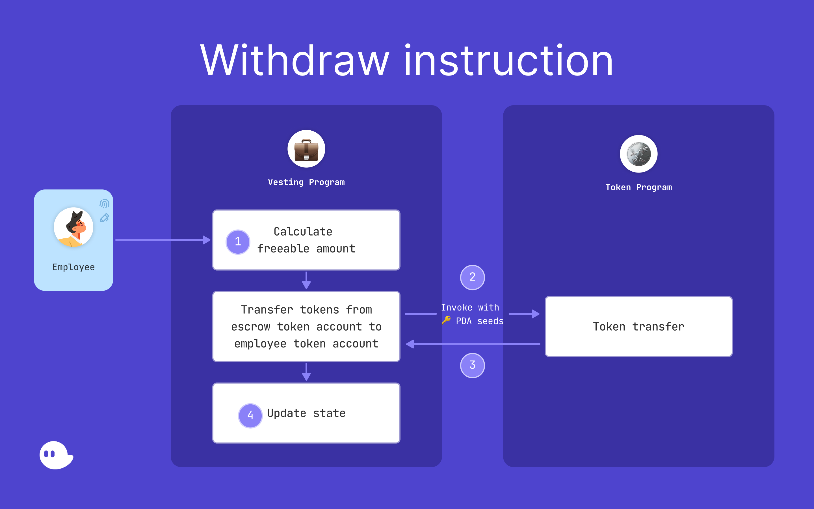
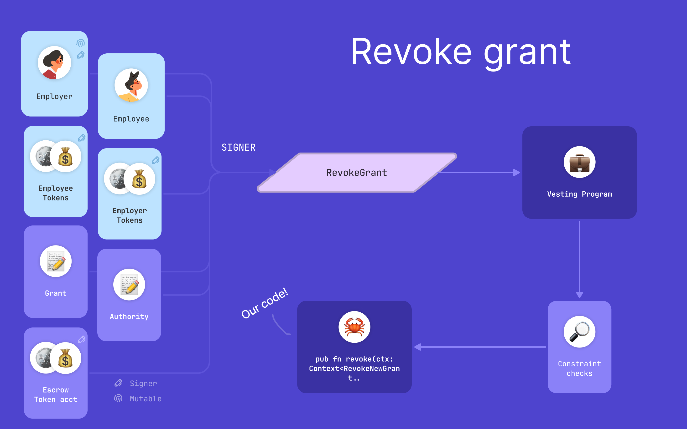
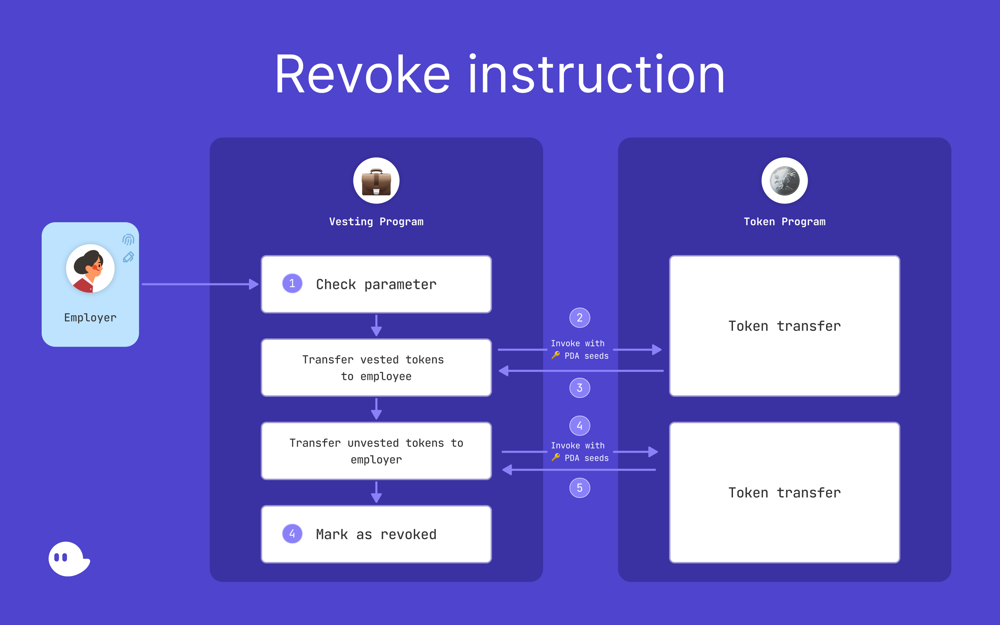

# Token Vesting Program - Solana Breakpoint 2022 🇵🇹

### 


## What is this about?

In my talk, I'll be covering basic Solana concepts by going through a practical example: creating a token vesting contract. This repository contains diagrams, program implementation, and program testing.


## Getting started

You can run the sample codebase using the following commands:

### Get to know Rust a little

Anchor recommends reading chapters 1-9 of [the Rust book](https://doc.rust-lang.org/book/title-page.html) which cover the basics of using Rust (Most of the time you don't need advanced Rust to write anchor programs).

### Install Anchor

You can install Anchor. Follow the installation guide on [this](https://www.anchor-lang.com/docs/installation) page.

### Run unit tests

```bash
❯ cd token_vesting_program
❯ anchor test
```

All tests should run successfully, Hurra!

## Initialize Instruction 📸




## Withdraw Instruction 📸




## Revoke Instruction 📸





### A few considerations

- All code is unaudited. Please sure at your own risk! ☠️
- The Anchor project config is fairly standard, but I did enable the `seeds` feature that is disabled in Anchor by default.


### Many many Thank Yous!

- Danni Hu (@danniphu) - for being supportive and helping me with slides
- Henry Elder (@Henry_E__) - for reviewing my code and for being the Anchor Expert
- Armani Ferrante (@armaniferrante) - for creating Anchor!
- Phantom fam - for being present and supporting me!